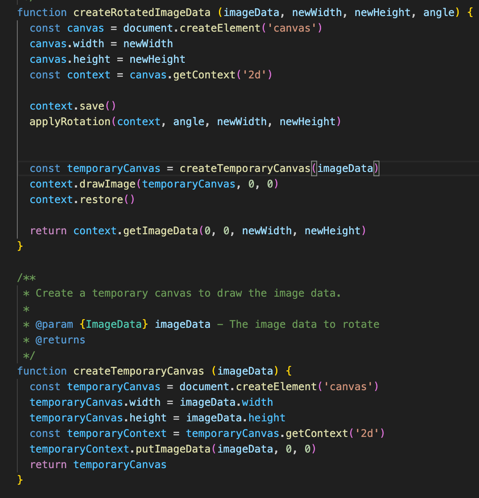
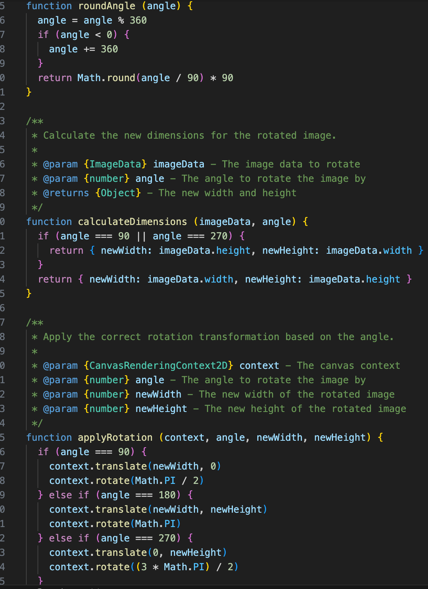
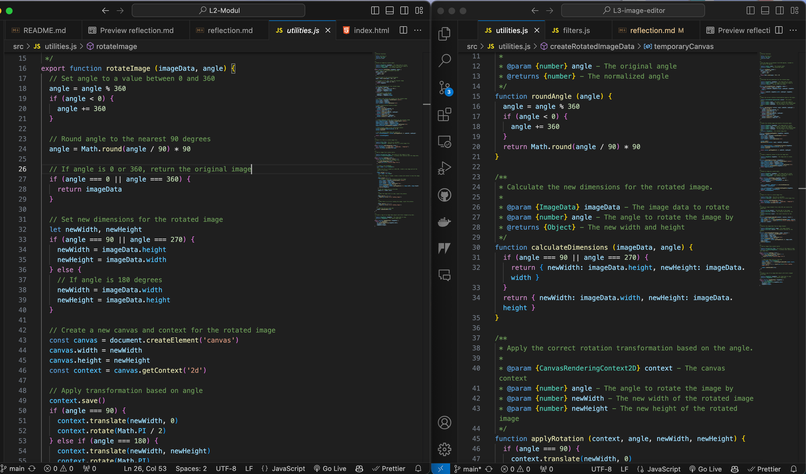
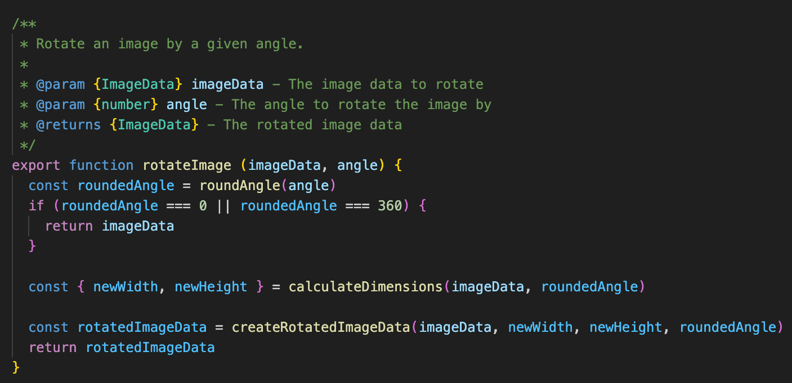
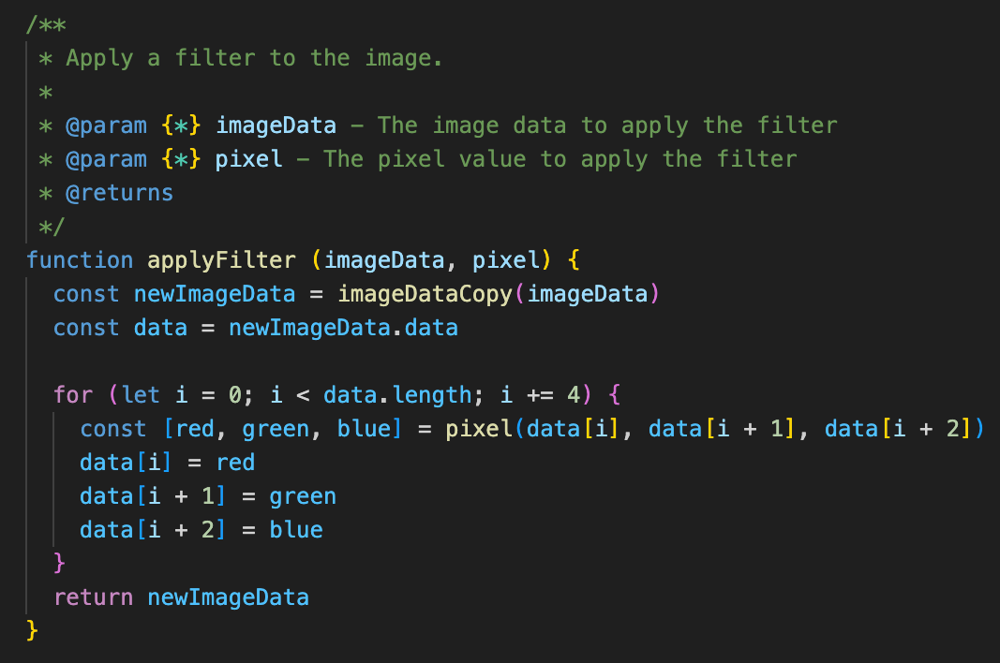
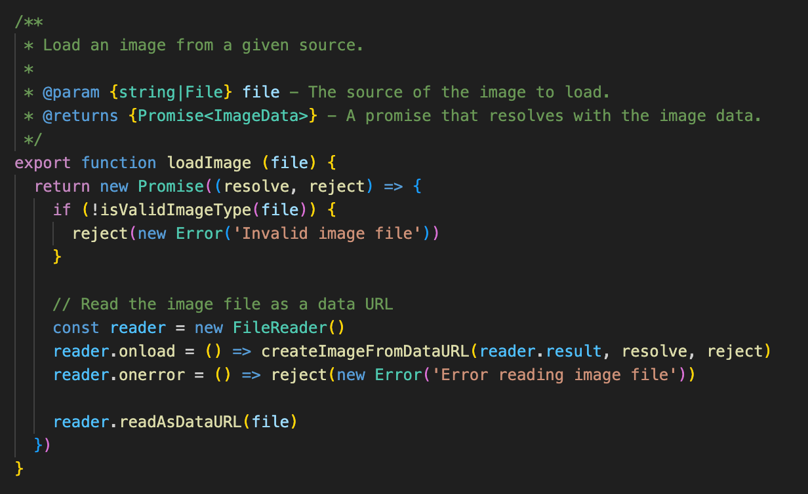
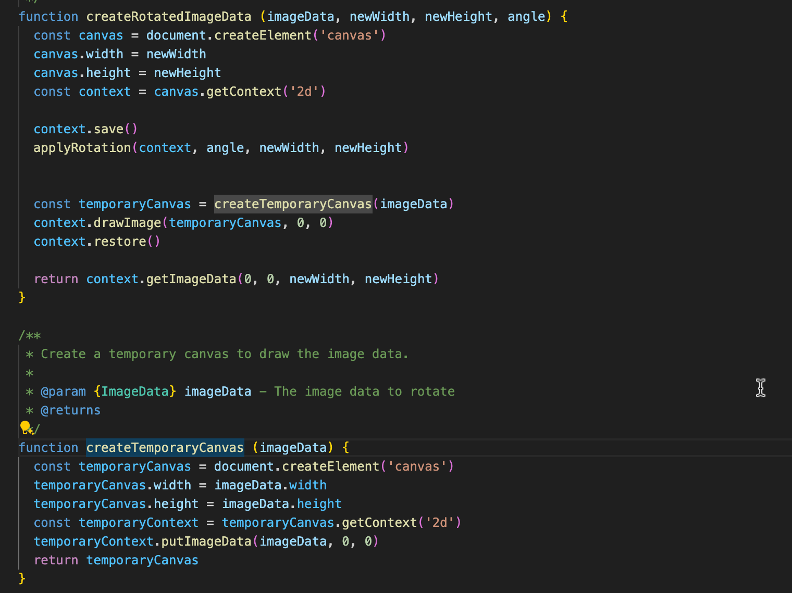
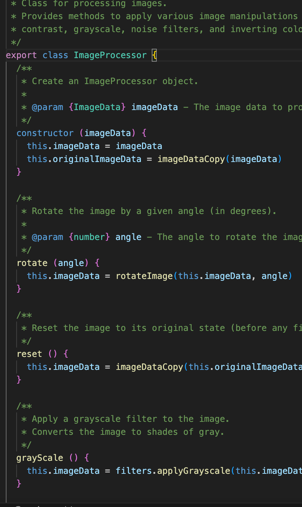
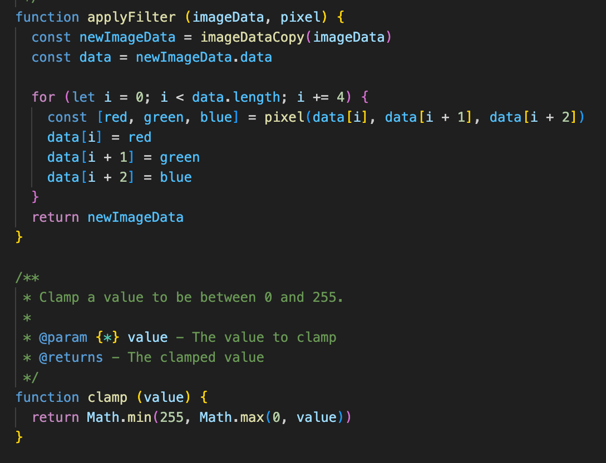

# Reflection: Clean Code Principles

## Chapter Reflections

### Chapter 2: Meaningful Names
The focus on naming was a key in improving the clarity of the code. By renaming variables to more descriptive names, such as from **val** to **value** and **tempCanvas** to **temporaryCanvas** made the code more readable. This was a simple change that made difference in the readability of the code.

### Chapter 3: Functions
Refactoring the functions to follow the single responsibility principle was a key takeaway from this chapter. By breaking down the functions into cleaner and smaller functions made the code not only more readable but also easier to maintain improved modularity. I split previous complex functions like **rotateImage()** and **loadImage()** into smaller helper functions like **roundAngle()**, **calculateDimensions()**, **createRotatedImageData()**, **applyRotation()**, **createImageFromDataURL()** and **resolveImageDataFromImage()**. By spliting the functions into smaller and shorter functions with a single responsibility, it made the code more readable and modular. 

### Chapter 4: Comments
A key takeaway from Workshop 2 meeting was that I should minimize the use of comments in the code (module). By minimizing the use of comments, made me think more about the naming of the variables and functions better. Many of the previous comments in the module was just explaining what the code was doing, for example I replace **// Round angle to the neraest 90 degrees** with **roundAngle** function. The previous comments shown in the left, and the refactored code shown in the right part of the image.

### Chapter 5: Formatting
The overall formatting was improved by spliting the longest functions (**rotateImage** and **loadImage**) into smaller functions. This made the code more readable and easier to follow for future development. I also used the **prettier** extension in VS Code to format the code.

### Chapter 6: Objects and Data Structures
By applying the principles from this chapter made me improve how the data was handled, for instance by seperating and creating the function **applyFilter()** as a helper function to handle the image data that later was used through all the filters. Previously each filter function had duplicated code for iterating over the pixels which was not very DRY. By creating the **applyFilter()** function, I could reuse the code and reduce the duplication.

### Chapter 7: Error Handling
For error handling, I used a more consistent approach, for example in **loadImage** function, instead of the previous multiple inline error checks, the code uses the helper functions like **createImageFromDataURL()** and **resolveImageDataFromImage()** to handle the errors more consistent.

### Chapter 8: Boundaries
From this chapter I tried to improve the code by encapsulating the third-party functions like **canvas** operations. This resulted into creation of the functions like **createTemporaryCanvas** and **createImageFromDataURL** that encapsulates the third-party functions.

### Chapter 9: Unit Tests
Refactoring the code into smaller functions with a single responsibility makes it easier for unit testing. The helper function for example **applyFilter()** can be unit tested into the different filter functions without the need to implement the whole canvas context every time.

### Chapter 10: Classes
The application has only one class at the moment which is the ImageProcessor class that encaplsulates and handles all the image processing operations. By encapsulating the neccessary operations into the class, it makes the code more modular and easier to maintain.

### Chapter 11: Systems
By refactoring the code, made the system more modular and maintainable for future development. Usage of helper functions such as **applyFilter()** and **clamp()** allows the system to use these helper functions for repeated operations.

## Conclusion
By implementing the principles from the book Clean Code resulted in a much more maintainable, readable and modular code. By defining meaningful names minimized the need for comments and made the code more readable throughout. Splitting the functions into smaller functions with a single responsibility not only makes the code more maintainable but also easier for future developmen abd testing.